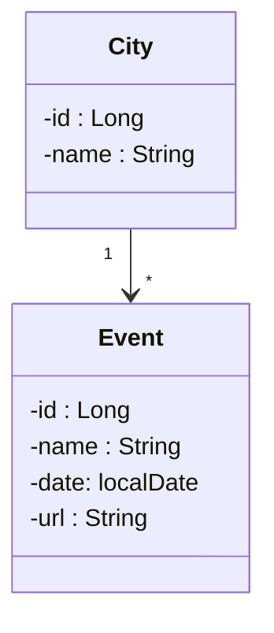

<h1> TDD - Test Driven Development Challenge </h1>
Sobre TDD - Test Driven Development 
Consiste em um desenvolvimento guiado por testes, esse método de desenvolver software se apoia em um ciclo curto de repetições e associa-se ao conceito de verificação e validação. O código é escrito a fim de validar as necessidades descritas no teste automatizado juntamente com as do software, portanto, o teste é desenvolvido primeiro e posteriormente é criado um código que inicialmente possa ser validado, sendo refatorado para alcançar padrões aceitáveis. 
 
Benefícios em sua aplicabilidade: 
 
Foco principal nos requisitos. 
Exige uma preocupação maior durante a escrita do código na intenção de atender as necessidades do teste, causando uma melhora no design do código.
Menos suscetível a erros/quebras na aplicação, mesmo ocorrendo incrementos no projeto. 
Processo básico de desenvolvimento: 
 
. Desenvolva o teste. 
. Escreva o código necessário para que seja validado pelo teste. 
. Execute os testes automatizados. 
. Refatore o código, ter um código limpo e legível é importante.  
Fonte: Wikipedia-TDD  

<h1>Desafio</h1>
O professor Nelio Alves da Escola DevSuperior propos como desafio para o final do capítulo 2 - Testes Automatizados do Bootcamp Spring e React a tarefa abaixo.  

TAREFA: TDD Event-City  

Implemente as funcionalidades necessárias para que os testes do projeto bds02 passem: https://github.com/devsuperior/bds02  

Teste de Integração CityController: Delete deve excluir a cidade e retornar 204 No Content. 
Teste de Integração CityController: Delete deve retornar 404 Not Found ao tentar excluir uma cidade com Id inexistente. 
Teste de Integração CityController: FindAll deve retornar uma lista não paginada com todas as cidades ordenadas por nomes na posição ascendente. 
Teste de Integração CityControllerDataIntegrity: Delete deve retornar 400 Bad Request quando a cidade estiver relacionada com um evento. 
Teste de Integração EventController: Update deve retornar o evento atualizado e 200 Ok. 
Teste de Integração EventController: Update deve retornar 404 Not Found na tentativa de atualizar um evento com Id inexistente.  
Este é um sistema de eventos e cidades com uma relação N-1 entre eles:

